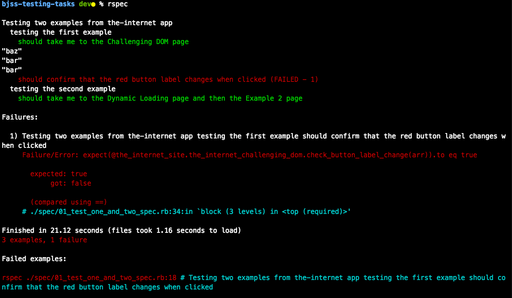
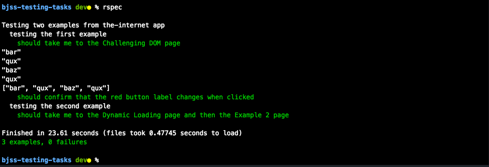
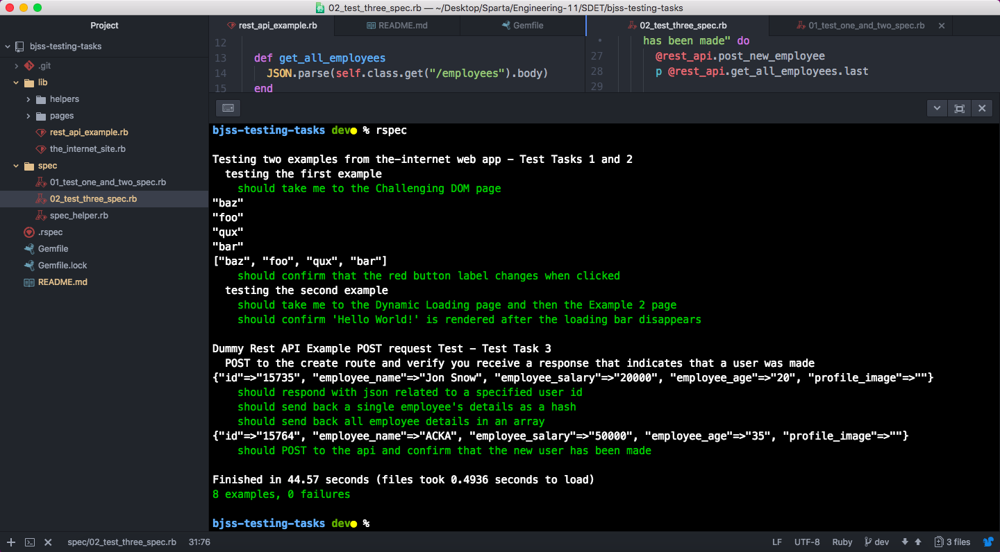

# 
 BJSS Testing Tasks 

### 
 Task 

To deliver a working test framework that aims towards "best practices" and publish on a public GitHub repository. It needs to be simple and extendible, and it shouldn't be complex or contain bloat e.g. uncommented code. The framework should test the following:

**TEST 1:**
Navigate to https://the-internet.herokuapp.com/, click `Challenging DOM` and confirm that the red button label changes after it's clicked.

**TEST 2:**
Navigate to https://the-internet.herokuapp.com/, click `Dynamically Loaded Page Elements` then click `Example 2: Element rendered after the fact`. Once start has been clicked, confirm 'Hello World!' is rendered after the loading bar disappears.

**TEST 3:**
POST to the http://dummy.restapiexample.com/ create route and verify you receive a response that indicates that a user was made.

This entire task makes use of:

* **Ruby** (programming language)
* **Capybara** (for web automation)
* **Webdriver and Chromedriver gems** (to drive browser)
* **Rspec gems** (for testing framework)
* **Httparty gem** (for http requests to api)
* **JSON gem** (for parsing json)

**How to Download and run tests** - click 'clone or download' button, download a zip of our project, unzip, run the bash commands `bundle install` and then `rspec` in the terminal (make sure to be in `main project folder` directory) and enjoy.

* `rspec` will run both test files.
* `rspec spec/02_test_three_spec.rb` will only run the test for the specified file.

### 
 How I tackled each task 

For **Task One and Two**, I built out a page object model and separated my methods into individual related classes as this helps keep the code DRY ("Don't Repeat Yourself") and maintainable.

I then used Selenium to drive the browser and automate each task process. For **Task One**, the button text is stored into an array and the last and second to last array items are compared. For **Task Two**, there is a set timer with intervals that checks for the presence of the 'Hello World!' text at each interval, and confirms the loading bar div has disappeared if the 'Hello World!' text is present.

**Task Three** involved me confirming that I could firstly make GET requests to the resource for a single employee instance and for all the employee instances. Once confirmed, I then proceeded to POST a hash to the resource (that needed to be converted and parsed as JSON) containing a few details, and confirmed the new instance by checking the last hash key values in a GET request for the whole resource.

### 
 Screenshots of terminal output when running `rspec` 

Below is an example of **Test One** failing due to repetition of the 'bar' text:

Below is an example of **Test One** passing as the text from the button wasn't repeated in this test execution:

Below shows all tests passing with the addition of the related terminal outputs for **Test One** and **Test Three**:

### 
 Summary 

I thoroughly enjoyed these tests as they helped me cement my learning and understanding of page object models, api testing, traversing the DOM and different ways of applying logic.

As requested in the bonus task, the following are links to other repositories I have made showing examples of my work/code:

* [Sparta Core Project One](https://github.com/ACKAdeyemi/sparta-core-project-one)

* [Sparta Advanced Cucumber POM](https://github.com/ACKAdeyemi/Sparta-Advanced-Cucumber-POM)

* [Sparta Custom Bootstrap Project](https://github.com/ACKAdeyemi/sparta-custom-bootstrap)

Thank you for the opportunity and for your consideration of my application.
